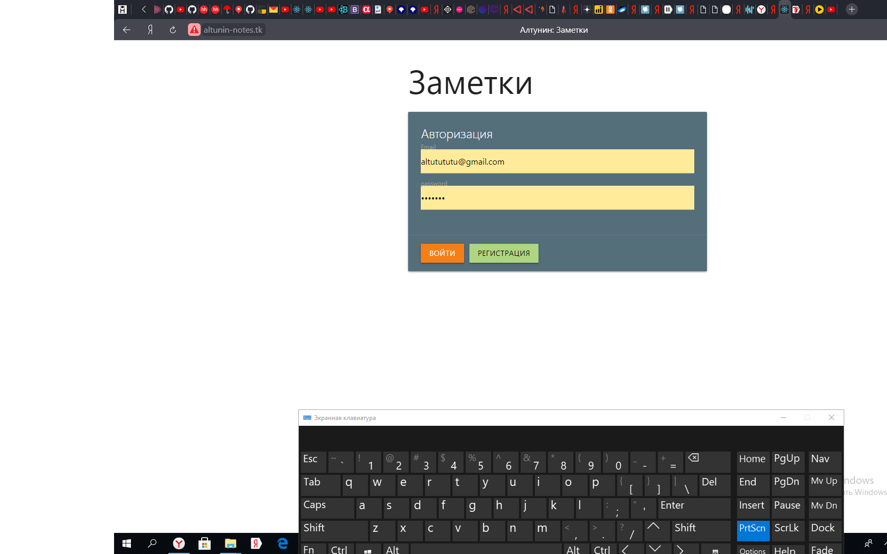
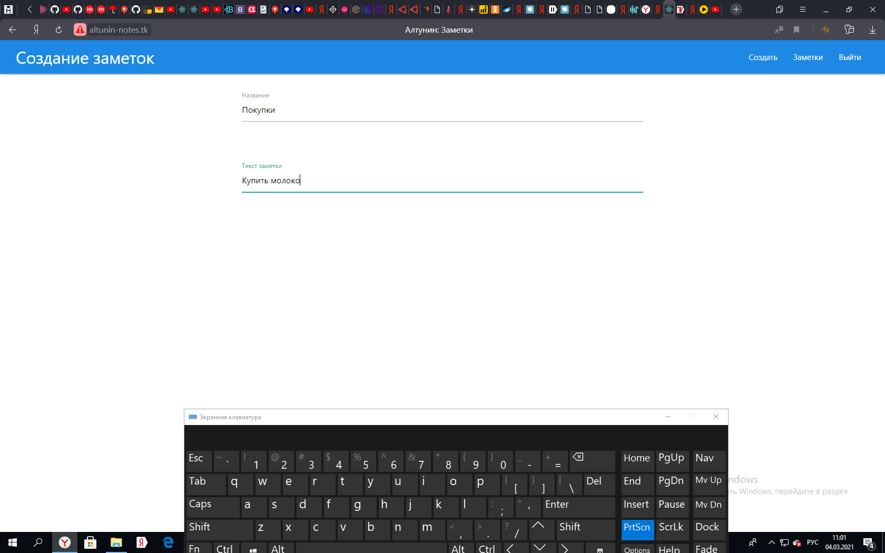
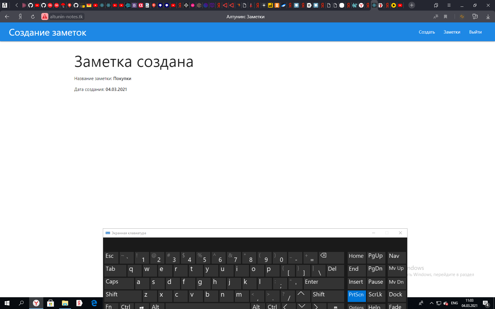
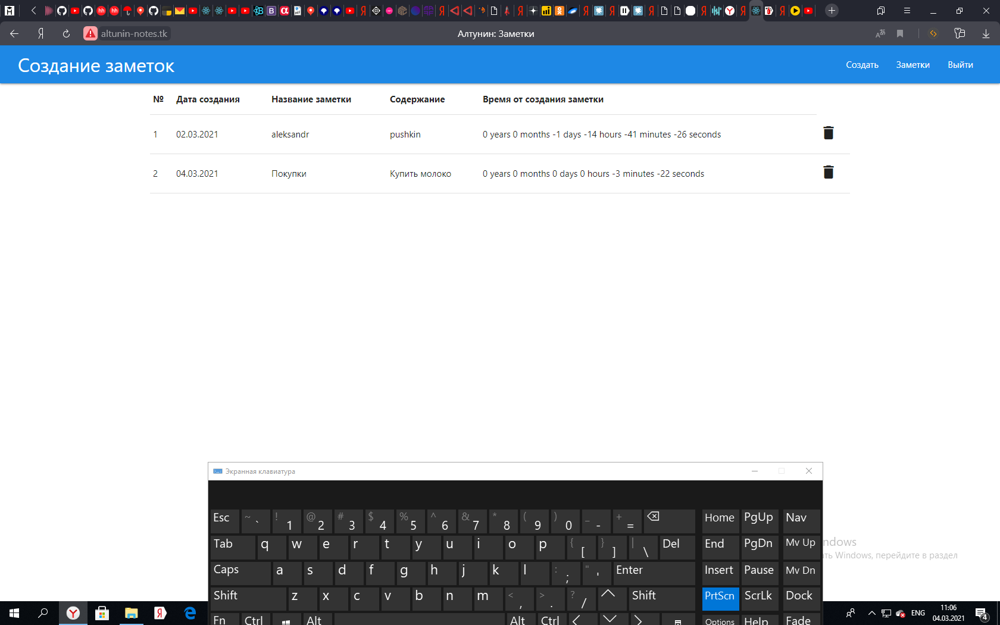

# NOTES
Индивидуальные заметки каждого зарегистрированного пользователя с динамическим отображением времени с момента создания заметки. 

* Pезультат можно посмотреть тут: http://www.altuninnotes.tk


## SETUP
```sh
git clone
```
```sh
$ npm install
```
```sh
$ npm run client:install
```
## RUN

```sh
$ npm run dev
```

## screenshots




